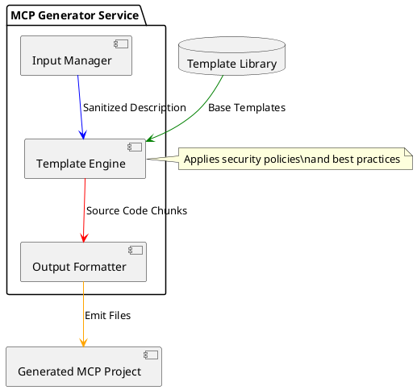
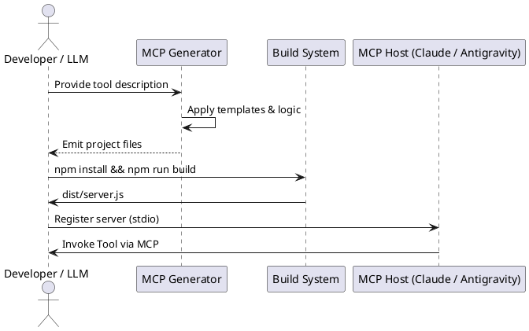

# Architecture: MCP Server Generator

## System Overview
The MCP Server Generator is a specialized service designed to create production-ready Model Context Protocol (MCP) servers. It translates natural language tool descriptions into structured, compliance-checked source code compatible with the `@modelcontextprotocol/sdk`.

## Component Architecture
The generator is a self-contained TypeScript module that handles the transformation from user input to a full project structure.

### Logical Components

1.  **Input Normalizer**:
    *   Validates input descriptions.
    *   Sanitizes tool names and project identifiers.
    *   Determines complexity and required dependencies.

2.  **Template Engine**:
    *   Uses structured string-literal templates to emit TypeScript code.
    *   Generates configuration files (`package.json`, `tsconfig.json`, `.env.example`).
    *   Creates deployment artifacts (`Dockerfile`, `manifest.json`).

3.  **Validation Layer**:
    *   Leverages Zod for schema enforcement in the generated server.
    *   Ensures the generated code follows secure coding patterns.

## Data Flow

### Generator Internal Flow

### Lifecycle of a Generated Server

## Implementation Details
*   **Transport**: Generated servers default to `stdio` transport for maximum compatibility.
*   **Language**: Strictly uses TypeScript (ESM) for the generated projects.
*   **Standards**: Follows the official Model Context Protocol specification for tool definition and communication.
*   **Validation**: Built-in Zod validation for all tool inputs in the generated code.